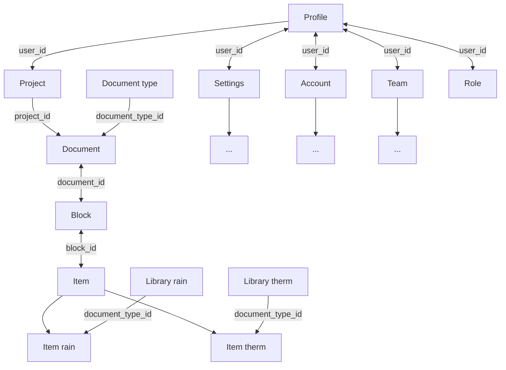

```mermaid
flowchart
USER-PROFILE[Profile] --> |user_id| USER-PROJECT[Project]
USER-PROJECT --> |project_id| DOCUMENT[Document]
DOCUMENT <--> |document_id| BLOCK[Block]
BLOCK[Block] <--> |block_id| ITEM[Item]
ITEM --> RAIN
ITEM --> THERM
LIBRARY_RAIN[Library rain] --> |document_type_id| RAIN[Item rain]
LIBRARY_THERM[Library therm] --> |document_type_id| THERM[Item therm]
DOCUMENT-TYPE[Document type] --> |document_type_id| DOCUMENT

USER-PROFILE[Profile] <--> |user_id| USER-SETTINGS[Settings]
USER-PROFILE[Profile] <--> |user_id| USER-ACCOUNT[Account]
USER-PROFILE[Profile] <--> |user_id| USER-TEAM[Team]
USER-PROFILE[Profile] <--> |user_id| USER-ROLE[Role]

USER-SETTINGS --> SETTINGS-DETAILS[...]
USER-ACCOUNT --> ACCOUNT-DETAILS[...]
USER-TEAM --> TEAM-DETAILS[...]
```
